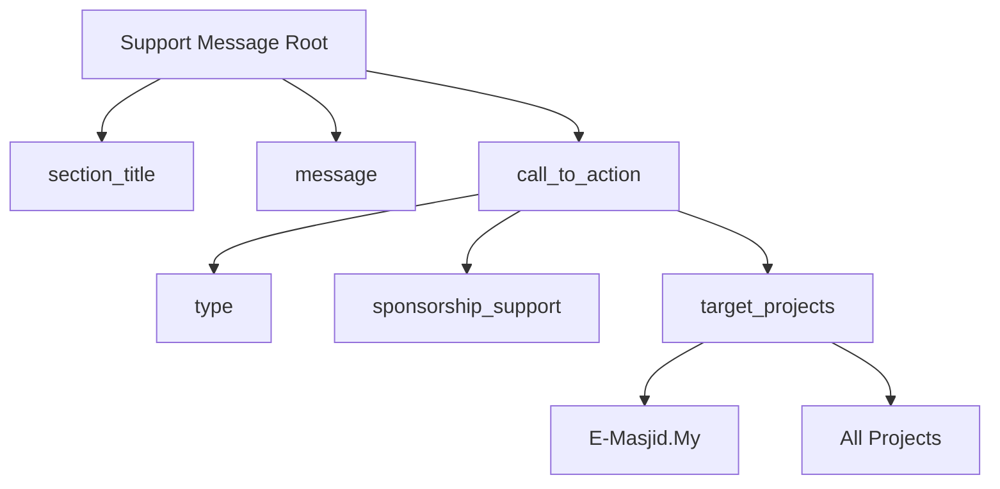

# Just a Tool Guy from BM

I'm currently focused on maintaining E-Masjid.My, a free and open-source (MIT License) mosque management system.

See More: Explore my other projects and work at 4w4n.com.

